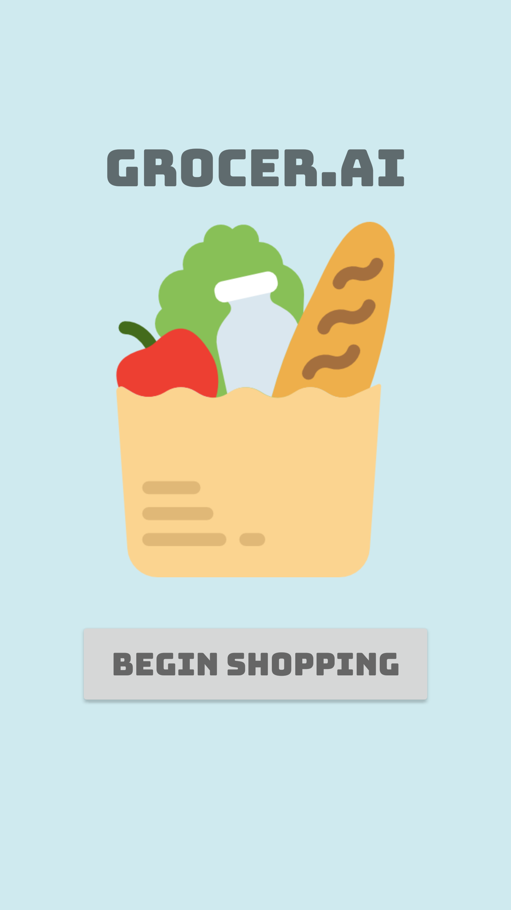
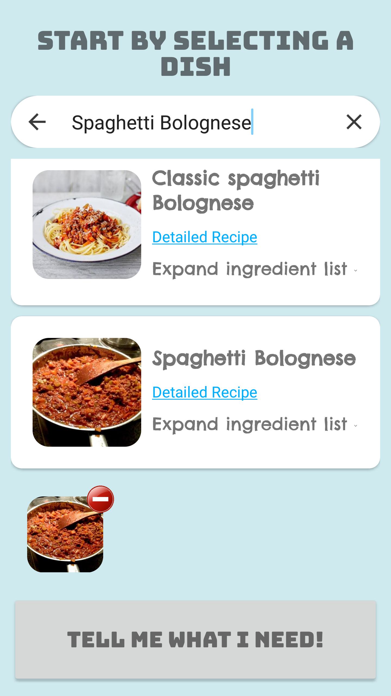
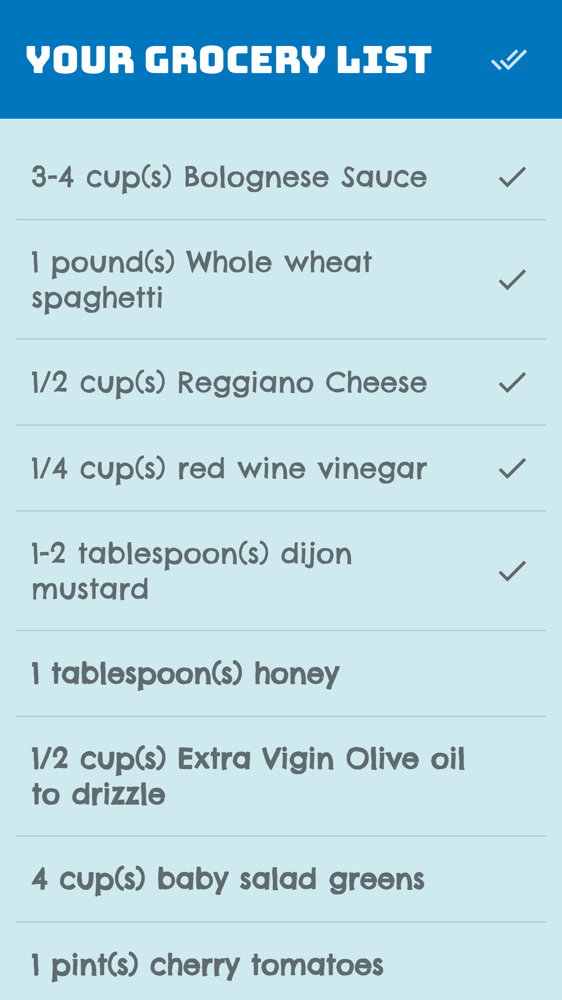

# GrocerAI
Grocery shopping assistant which generates and manages comprehensive shopping lists for selected recipes.\
The recipes are fetched from the Edamam Recipe Search API, and the user is presented with a checkable shopping list containing all the ingredients that go into one or more of the selected recipes.
# User Interface
  
